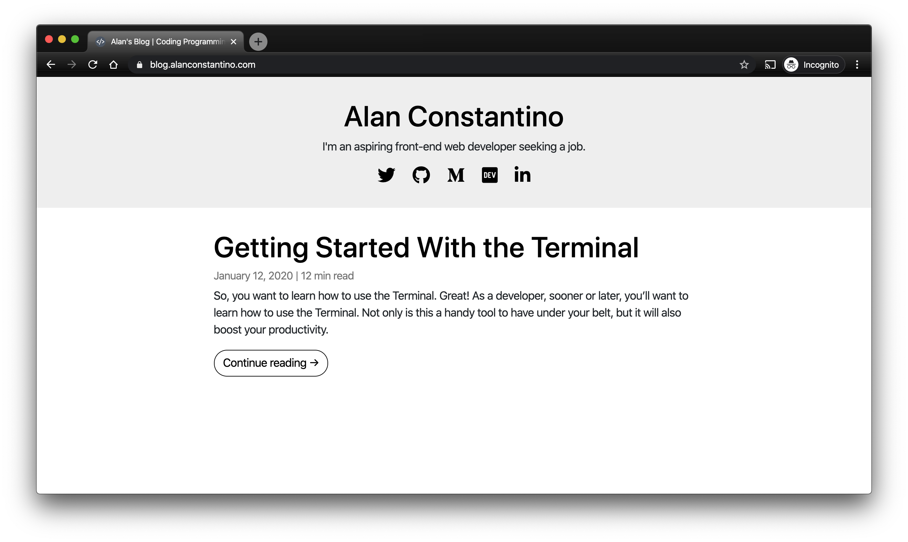

# [Personal-blog](https://blog.alanjc.com/)

This is my [personal blog](https://blog.alanjc.com/) where I talk about coding, web development, and other miscellaneous topics.

~~This blog was built using Bootstrap, HTML, CSS, and a little bit of JavaScript.~~

This blog was rewritten in pure HTML and CSS. No Bootstrap bloat!

The looks of the blog were inspired by the [Evermore template](https://webflow.com/templates/html/evermore-blog-website-template).

The icons used are from [Font Awesome](https://fontawesome.com/icons).

# Technologies

- Utilized HTML and CSS.
- [Skeleton.css](http://getskeleton.com) library

# Images

_Images are out of date._

